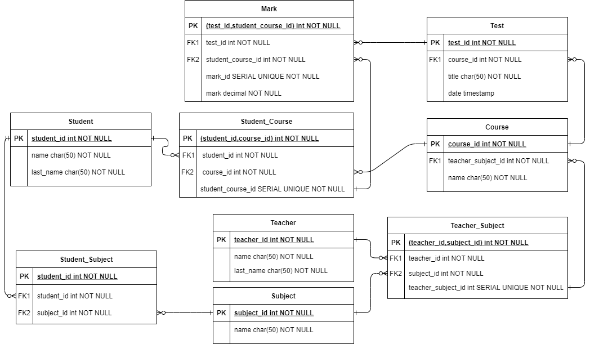

# testfullstack2021Solution
https://github.com/capitaria/testfullstack2021/edit/main/test-fullstack.md

## STACK

1. Postgresql : Base de datos
2. Node.js: Entorno de ejecución JS backend
3. Express: Framework backend para RESTful API
4. HTML, CSS Y JS: Lenguajes para Frontend

## Requerimientos

Haber instalado con anterioridad las siguientes tecnologias:

* NodeJS: https://nodejs.org/en/download/ , instalar version LTS usando installer en caso de Windows y Mac respectivamente. En caso de Linux seguir instrucciones dada
su distribucion en https://github.com/nodesource/distributions/blob/master/README.md#debmanual
* Postgresql: https://www.postgresql.org/download/ , instalar version >= 12. Contraseña del usuario 'postgres' debe ser 'password' y el puerto el predeterminado 5432
* Git (opcional): https://git-scm.com/downloads , herramienta de versionamiento para poder clonar este proyecto. Otra opcion es descargar el ZIP en el boton de Code.

## Instalación

Primero que todo, abrir una terminal/consola y revisar si es que se tiene instalado correctamente node y npm (incluido en la instalación de node)
```
node -v
```
```
npm -v
```

En Linux:

Hay que iniciar el servidor de Postgresql usando alguno de estos comandos:
```
sudo service postgresql start
```
```
sudo systemctl start postgresql
```

y verificar que este funcionando usando: 
```
sudo service postgresql status
```
```
sudo systemctl status postgresql
```

En Windows:
1. Buscar services.msc en el Run window (Windows key + R)
2. Buscar el servicio postgres e iniciarlo en las opciones con click derecho

En la localización del proyecto, en la raiz, para instalar las dependencias 
```
npm install
```

Para crear la base de datos que se va a usar se debe ejecutar el siguiente comando (estando en la raiz del proyecto)
```
node src/utils/createdb.js
```

Para crear las tablas y relaciones de la base de datos se debe correr el siguiente comando (se puede demorar unos 10 segundos):
```
npm run runQuery
```

Por ultimo, iniciar el servidor NodeJS:
```
npm run startdev
```

Dejar la terminal/consola abierta. 
El servidor esta escuchando el puerto 3000, es decir, localhost:3000


## Testing

Para poder interactuar con la base de datos es necesario contar con alguna plataforma API client como Postman https://www.postman.com/ o Insomnia https://insomnia.rest/


## Documentacion

Se tiene operaciones CRUD para todas las tablas excepto la relacion Student_Subject.



1. Student: Tabla que representa a los alumnos. Llave primaria entero unico de identificador. Campos: name (nombres), last_name (apellidos), ambos cadenas de caracteres.
2. Teacher: Tabla que representa a los profesores. Llave primaria entero unico de identificador. Campos: name (nombres), last_name (apellidos), ambos cadenas de caracteres.
3. Subject: Tabla que representa los ramos existentes, un ramo es la materia a enseñar (Ej: Matematica, Lenguaje, Fisica, Quimica, etc). Llave primaria entero unico de identificador. Campos: name (nombre).
4. Student_Teacher: Tabla que representa la asociacion entre alumnos y ramos. Llave primaria entero unico de identificador. Llave primaria compuesta student_id y subject_id por lo que no se puede asignar mas de una ves un estudiante a un ramo. Campos: Llaves foraneas student_id (identificador del alumno) y subject_id (identificador del ramo).
5. Teacher_Subject: Tabla que representa la asociacion entre profesores y ramos. Llave primaria compuesta teacher_id y subject_id por lo que no se puede asignar mas de una ves un profesor a un ramo en especifico. Campos: Llaves foraneas teacher_id (identificador del profesor) y subject_id (identificador del ramo) y un identificador entero unico para cada asociacion profesor-ramo (teacher_subject_id)
6. Course: Tabla que representa los cursos. Un curso en este contexto es una instancia de enseñanza de un ramo impartido por un profesor (Ej: profesor que enseña matematica imparte un curso llamado 'A-2'). Llave primaria entero unico de identificador (course_id). Campos: Llave foranea teacher_subject_id (identificador de la tabla intermedia Teacher_Subject) y subject_id (identificador del ramo) y un nombre. Debido a que no tiene una llave primaria compuesta un profesor que imparte un ramo puede enseñar en varios cursos.
7. Student_Course: Tabla que representa la asociacion entre alumnos y cursos. Llave primaria compuesta student_id y course_id por lo que no se puede asignar mas de una ves un alumno especifico a un curso en especifico para evitar duplicidades. Campos: Llaves foraneas student_id (identificador del alumno) y course_id (identificador del curso) y un identificador entero unico para cada asociacion alumno-curso (student_course_id)
8. Test: Tabla que representa a las pruebas. Llave primaria entero unico de identificador (test_id). Campos: Llave foranea course_id (identificador de la tabla Course), title (titulo de la prueba) y date (fecha en la que se da la prueba). Un curso puede tener una cantidad no determinada de pruebas pero una prueba pertenece solamente a un curso.
9. Mark: Tabla que representa a las notas. Llave primaria compuesta test_id y student_course_id por lo que no se puede poner mas de una nota a una misma prueba asociada a un alumno y curso especificos para evitar duplicidades. Campos: Llaves foraneas test_id (identificador de la prueba) y student_course_id (identificador de la asociacion alumno-curso), un identificador entero unico (mark_id) y la nota en si (mark) la cual esta entre un 1.0 y un 7.0. 

**Nota:** Cuando se asocia a un alumno a un curso, se crea la asociacion entre este alumno y el ramo asociado al curso. Un alumno no puede estar asociado a 2 cursos de un ramo al mismo tiempo.

El formato del body a enviar es JSON

A continuación se presentaran los metodos y sus endpoints de cada recurso
La url base es localhost:3000 y de alli se le agregan las terminaciones

La respuesta de la API es de formato JSON. Los datos se almacenan en un arreglo de JSON de nombre 'messages'
```
{
  messages:[
      {...},
      {...}
      .
      .
      .
  ]
}
```
En caso de las listas de registros existentes en una tabla, se responde con un formato similar pero se le agrega el numero total de registros en 'totalRows' (entero):
```
{
  totalRows: 2
  messages:[
      {...},
      {...}
  ]
}
```

## Student

**GET /alumno/{student_id}**

localhost:3000/alumno/{student_id}

| Campo      | Tipo   | Descripción                    |
|------------|--------|--------------------------------|
| student_id | Entero | Identificador unico del alumno |

Retorno: JSON que contiene el identificador enviado (student_id), nombre (name) y apellido (last_name) del alumno

**GET /lista_alumnos**

localhost:3000/lista_alumnos

Retorno: JSON que contiene todos los registros de alumnos de la tabla Student(identificador (student_id), nombre (name) y apellido (last_name))

**POST /alumno**

localhost:3000/alumno

| Parametro (body) | Tipo   | Descripción                                  | 
|------------------|--------|----------------------------------------------|
| name             | String | (obligatorio) Nombre del alumno              |
| last_name        | String | (obligatorio) Apellido del alumno            |

Retorno: JSON que contiene el identificador unico creado para el estudiante (student_id), nombre (name) y apellido (last_name) del alumno
Ej:
```
{
  messages:[
    {student_id: 1, name: 'pedro', last_name: 'hidalgo'}
  ]
}
```

**PUT /alumno/{student_id}**

localhost:3000/alumno/{student_id}

| Campo      | Tipo   | Descripción                    |
|------------|--------|--------------------------------|
| student_id | Entero | Identificador unico del alumno |

| Parametro (body) | Tipo   | Descripción                                  | 
|------------------|--------|----------------------------------------------|
| name             | String | (opcional) Nombre del alumno                 |
| last_name        | String | (opcional) Apellido del alumno               |

Retorno: Respuesta en el campo 'messages' de que se completo satisfactoriamente la modificacion o se dio un error

**DELETE /alumno/{student_id}**

localhost:3000/alumno/{student_id}

| Campo      | Tipo   | Descripción                    |
|------------|--------|--------------------------------|
| student_id | Entero | Identificador unico del alumno |

Retorno: Respuesta en el campo 'messages' de que se completo satisfactoriamente la eliminacion del registro del alumno o se dio un error


## Teacher

**GET /profesor/{teacher_id}**

localhost:3000/alumno/{teacher_id}

| Campo      | Tipo   | Descripción                      |
|------------|--------|----------------------------------|
| teacher_id | Entero | Identificador unico del profesor |

Retorno: JSON que contiene el identificador enviado (teacher_id), nombre (name) y apellido (last_name) del profesor

**GET /lista_profesores**

localhost:3000/lista_profesores

Retorno: JSON que contiene todos los registros de alumnos de la tabla Teacher (identificador (student_id), nombre (name) y apellido (last_name))

**POST /profesor**

localhost:3000/profesor

| Parametro (body) | Tipo   | Descripción                                  | 
|------------------|--------|----------------------------------------------|
| name             | String | (obligatorio) Nombre del profesor            |
| last_name        | String | (obligatorio) Apellido del profesor          |

Retorno: JSON que contiene el identificador unico creado para el estudiante (teacher_id), nombre (name) y apellido (last_name) del profesor
Ej
```
{
  messages:[
    {teacher_id: 3, name: 'pedro', last_name: 'arroyo'}
  ]
}
```

**PUT /profesor/{teacher_id}**

localhost:3000/profesor/{teacher_id}

| Campo      | Tipo   | Descripción                      |
|------------|--------|----------------------------------|
| teacher_id | Entero | Identificador unico del profesor |

| Parametro (body) | Tipo   | Descripción                                  | 
|------------------|--------|----------------------------------------------|
| name             | String | (opcional) Nombre del profesor               |
| last_name        | String | (opcional) Apellido del profesor             |

Retorno: Respuesta en el campo 'messages' de que se completo satisfactoriamente la modificacion o se dio un error

**DELETE /profesor/{teacher_id}**

localhost:3000/profesor/{teacher_id}

| Campo      | Tipo   | Descripción                      |
|------------|--------|----------------------------------|
| teacher_id | Entero | Identificador unico del profesor |

Retorno: Respuesta en el campo 'messages' de que se completo satisfactoriamente la eliminacion del registro del profesor o se dio un error


## Subject

**GET /ramo/{subject_id}**

localhost:3000/ramo/{subject_id}

| Campo      | Tipo   | Descripción                      |
|------------|--------|----------------------------------|
| subject_id | Entero | Identificador unico del ramo     |

Retorno: JSON que contiene el identificador enviado (subject_id) y el nombre (name) del ramo

**GET /lista_ramos**

localhost:3000/lista_ramos

Retorno: JSON que contiene todos los registros de ramos de la tabla Subject (identificador (subject_id) y nombre (name))

**POST /ramo**

localhost:3000/ramo

| Parametro (body) | Tipo   | Descripción                                  | 
|------------------|--------|----------------------------------------------|
| name             | String | (obligatorio) Nombre del ramo                |

Retorno: JSON que contiene el identificador unico creado para el ramo (subject_id) y nombre (name) 
```
{
  messages:[
    {subject_id: 1, name: 'Calculo I'}
  ]
}
```

**PUT /ramo/{subject_id}**

localhost:3000/ramo/{subject_id}

| Campo      | Tipo   | Descripción                      |
|------------|--------|----------------------------------|
| subject_id | Entero | Identificador unico del ramo     |

| Parametro (body) | Tipo   | Descripción                                  | 
|------------------|--------|----------------------------------------------|
| name             | String | (opcional) Nombre del ramo                   |

Retorno: Respuesta en el campo 'messages' de que se completo satisfactoriamente la modificacion o se dio un error

**DELETE /ramo/{subject_id}**

localhost:3000/ramo/{subject_id}

| Campo      | Tipo   | Descripción                      |
|------------|--------|----------------------------------|
| subject_id | Entero | Identificador unico del ramo     |

Retorno: Respuesta en el campo 'messages' de que se completo satisfactoriamente la eliminacion del registro del ramo o se dio un error


## Teacher_Subject

**GET /profesor_ramo/{teacher_subject_id}**

localhost:3000/profesor_ramo/{teacher_subject_id}

| Campo              | Tipo   | Descripción                                          |
|--------------------|--------|------------------------------------------------------|
| teacher_subject_id | Entero | Identificador unico de la relacion profesor-ramo     |

Retorno: JSON que contiene el identificador enviado (teacher_subject_id), identificador del ramo (subject_id) y del profesor (teacher_id)

**GET /profesor_ramo/{teacher_id}/{subject_id}**

localhost:3000/profesor_ramo/{teacher_id}/{subject_id}

| Campo      | Tipo   | Descripción                      |
|------------|--------|----------------------------------|
| teacher_id | Entero | Identificador unico del profesor |
| subject_id | Entero | Identificador unico del ramo     |

Retorno: JSON que contiene el identificador unico de la relacion profesor-ramo (teacher_subject_id)


**GET /lista_profesores_ramos**

localhost:3000/lista_profesores_ramos

Retorno: JSON que contiene todos los registros de ramos de la tabla Teacher_Subject (identificador (teacher_subject_id), identificador del ramo (subject_id) y del profesor (teacher_id))

**POST /profesor_ramo**

localhost:3000/profesor_ramo

| Parametro (body) | Tipo   | Descripción                                    | 
|------------------|--------|------------------------------------------------|
| teacher_id       | Entero | (obligatorio) Identificador unico del profesor |
| subject_id       | Entero | (obligatorio) Identificador unico del ramo     |

Retorno: JSON que contiene el identificador unico creado para la relacion profesor-ramo (teacher_subject_id), identificador de profesor (teacher_id) y ramo (subject_id)
```
{
  messages:[
    {teacher_subject_id: 3, teacher_id: 1, subject_id: 1}
  ]
}
```

**PUT /profesor_ramo/{teacher_subject_id}**

localhost:3000/profesor_ramo/{teacher_subject_id}

| Campo              | Tipo   | Descripción                                          |
|--------------------|--------|------------------------------------------------------|
| teacher_subject_id | Entero | Identificador unico de la relacion profesor-ramo     |


| Parametro (body) | Tipo   | Descripción                                    | 
|------------------|--------|------------------------------------------------|
| teacher_id       | Entero | Identificador unico del profesor |
| subject_id       | Entero | Identificador unico del ramo     |

Retorno: Respuesta en el campo 'messages' de que se completo satisfactoriamente la modificacion o se dio un error

**DELETE /profesor_ramo/{teacher_subject_id}**

localhost:3000/profesor_ramo/{teacher_subject_id}

| Campo              | Tipo   | Descripción                                          |
|--------------------|--------|------------------------------------------------------|
| teacher_subject_id | Entero | Identificador unico de la relacion profesor-ramo     |

Retorno: Respuesta en el campo 'messages' de que se completo satisfactoriamente la eliminacion del registro de la relacion profesor-ramo o se dio un error


## Course

**GET /curso/{course_id}**

localhost:3000/curso/{course_id}

| Campo      | Tipo   | Descripción                    |
|------------|--------|--------------------------------|
| course_id  | Entero | Identificador unico del curso  |

Retorno: JSON que contiene el identificador enviado (course_id) y de la relacion profesor-ramo (teacher_subject_id) y nombre (name) del curso 

**GET /lista_cursos**

localhost:3000/lista_cursos

Retorno: JSON que contiene todos los registros de alumnos de la tabla Course (identificador (course_id), relacion profesor-ramo (teacher_subject_id) y nombre (name) del curso ))

**POST /curso**

localhost:3000/curso

| Parametro (body)               | Tipo   | Descripción                                  | 
|--------------------------------|--------|----------------------------------------------|
| teacher_subject_id             | String | (obligatorio) Nombre del alumno              |
| name                           | String | (obligatorio) Apellido del alumno            |

Retorno: JSON que contiene el identificador unico creado para el curso (course_id), relacion profesor-ramo (teacher_subject_id) y nombre (name) del curso ))
Ej:
```
{
  messages:[
    {course_id: 3, teacher_subject_id: 3, name: 'Sección A-1'}
  ]
}
```

**PUT /curso/{course_id}**

localhost:3000/curso/{course_id}

| Campo      | Tipo   | Descripción                    |
|------------|--------|--------------------------------|
| course_id  | Entero | Identificador unico del curso  |

| Parametro (body)               | Tipo   | Descripción                                  | 
|--------------------------------|--------|----------------------------------------------|
| teacher_subject_id             | String | (opcional) Relacion profesor-ramo            |
| name                           | String | (opcional) Nombre del curso                  |

Retorno: Respuesta en el campo 'messages' de que se completo satisfactoriamente la modificacion o se dio un error

**DELETE /curso/{course_id}**

localhost:3000/curso/{course_id}

| Campo      | Tipo   | Descripción                    |
|------------|--------|--------------------------------|
| course_id  | Entero | Identificador unico del curso  |

Retorno: Respuesta en el campo 'messages' de que se completo satisfactoriamente la eliminacion del registro del curso o se dio un error.

**Nota:** Al borrar un curso no se elimina la relacion profesor-ramo Teacher_Subject, solo las Pruebas asociadas, alumnos inscritos (Student_Course) y sus notas (Mark)

## Student_Course

**GET /alumno_curso/{student_course_id}**

localhost:3000/alumno_curso/{student_course_id}

| Campo              | Tipo   | Descripción                                      |
|--------------------|--------|--------------------------------------------------|
| student_course_id  | Entero | Identificador unico de la relacion alumno-curso  |

Retorno: JSON que contiene el identificador enviado (student_course_id), alumno (student_id) y curso (course_id) del curso 

**GET /alumno_curso/{student_id}/{course_id}**

localhost:3000/alumno_curso/{student_id}/{course_id}

| Campo      | Tipo   | Descripción                      |
|------------|--------|----------------------------------|
| student_id | Entero | Identificador unico del alumno   |
| course_id  | Entero | Identificador unico del curso    |

Retorno: JSON que contiene el identificador unico de la relacion alumno-curso (student_course_id)

**GET /lista_alumnos_cursos**

localhost:3000/lista_alumnos_cursos

Retorno: JSON que contiene todos los registros de la relacion alumno-curso de la tabla Student_Course (identificador (student_course_id), alumno (student_id) y curso (course_id) del curso)

**POST /alumno_curso**

localhost:3000/alumno_curso

| Parametro (body)       | Tipo   | Descripción                                  | 
|------------------------|--------|----------------------------------------------|
| student_id             | Entero | (obligatorio) Identificador unico del alumno |
| course_id              | Entero | (obligatorio) Identificador unico del curso  |

Retorno: JSON que contiene el identificador unico creado para la relacion alumno-curso (student_course_id), alumno (teacher_subject_id) y curso (course_id)
Ej:
```
{
  messages:[
    {student_course_id: 3, student_id: 1, course_id: 3}
  ]
}
```

**PUT /alumno_curso/{student_course_id}**

localhost:3000/alumno_curso/{student_course_id}

| Campo              | Tipo   | Descripción                                      |
|--------------------|--------|--------------------------------------------------|
| student_course_id  | Entero | Identificador unico de la relacion alumno-curso  |

| Parametro (body)       | Tipo   | Descripción                                  | 
|------------------------|--------|----------------------------------------------|
| student_id             | Entero | (obligatorio) Identificador unico del alumno |
| course_id              | Entero | (obligatorio) Identificador unico del curso  |

Retorno: Respuesta en el campo 'messages' de que se completo satisfactoriamente la modificacion o se dio un error

**DELETE /alumno_curso/{student_course_id}**

localhost:3000/alumno_curso/{student_course_id}

| Campo              | Tipo   | Descripción                                      |
|--------------------|--------|--------------------------------------------------|
| student_course_id  | Entero | Identificador unico de la relacion alumno-curso  |

Retorno: Respuesta en el campo 'messages' de que se completo satisfactoriamente la eliminacion del registro de la relacion alumno-curso o se dio un error.

**Nota:** Al borrar una de estas relaciones se elimina la relacion de este alumno y el ramo (student_subject) y sus notas del curso (mark)

## Test

**GET /prueba/{test_id}**

localhost:3000/prueba/{test_id}

| Campo      | Tipo   | Descripción                       |
|------------|--------|-----------------------------------|
| test_id    | Entero | Identificador unico de la prueba  |

Retorno: JSON que contiene el identificador enviado (test_id), curso (course_id), titulo de la prueba (title) y fecha en que se da la prueba (date)

**GET /prueba**

localhost:3000/prueba

Retorno: JSON que contiene todos los registros de pruebas de la tabla Test (identificador (test_id), curso (course_id), titulo de la prueba (title) y fecha en que se da la prueba (date))

**POST /prueba**

localhost:3000/prueba

| Parametro (body)               | Tipo                       | Descripción                                  | 
|--------------------------------|----------------------------|----------------------------------------------|
| course_id                      | Entero                     | (obligatorio) Nombre del alumno              |
| title                          | String                     | (obligatorio) Apellido del alumno            |
| date                           | Formato TIMESTAMP (string) | (opcional) fecha en que se da la prueba      |

Retorno: JSON que contiene el identificador unico creado para la prueba (test_id), curso (course_id), relacion profesor-ramo (teacher_subject_id) y nombre (name) del curso
Ej:
```
{
  messages:[
    {test_id: 1, course_id: 3, title: 'PEP I: Introduccion derivadas e integrales', date: '2021/09/10'}
  ]
}
```

**PUT /prueba/{course_id}**

localhost:3000/prueba/{test_id}

| Campo      | Tipo   | Descripción                       |
|------------|--------|-----------------------------------|
| test_id    | Entero | Identificador unico de la prueba  |

| Parametro (body)               | Tipo                       | Descripción                                  | 
|--------------------------------|----------------------------|----------------------------------------------|
| course_id                      | Entero                     | (obligatorio) Nombre del alumno              |
| title                          | String                     | (obligatorio) Apellido del alumno            |
| date                           | Formato TIMESTAMP (string) | (opcional) fecha en que se da la prueba      |

Retorno: Respuesta en el campo 'messages' de que se completo satisfactoriamente la modificacion o se dio un error

**DELETE /prueba/{test_id}**

localhost:3000/prueba/{test_id}

| Campo      | Tipo   | Descripción                       |
|------------|--------|-----------------------------------|
| test_id    | Entero | Identificador unico de la prueba  |

Retorno: Respuesta en el campo 'messages' de que se completo satisfactoriamente la eliminacion de la prueba o se dio un error.

**Nota:** Al borrar una prueba no se elimina el curso, solo las notas asociadas a esta prueba

## Mark

**GET /nota/{mark_id}**

localhost:3000/nota/{mark_id}

| Campo      | Tipo   | Descripción                       |
|------------|--------|-----------------------------------|
| mark_id    | Entero | Identificador unico de la nota    |

Retorno: JSON que contiene el identificador enviado (mark_id), prueba (test_id), relacion alumno-curso (student_course_id) y nota del 1.0 al 7.0 (mark)

**GET /nota**

localhost:3000/nota

Retorno: JSON que contiene todos los registros de notas de la tabla Mark ((mark_id), prueba (test_id), relacion alumno-curso (student_course_id) y nota del 1.0 al 7.0 (mark))

**FUNCIONALIDAD: Listar a los alumnos junto a su promedio de notas**

**GET /lista_promedio_general_alumnos**

localhost:3000/lista_promedio_general_alumnos

Retorno: JSON que contiene todos los registros de promedio de notas. Se entrega el identificador del estudiante (student_id), nombre (name), apellido (last_name) y el promedio de notas del 1.0 al 7.0 (mark)

El promedio de notas de cada alumno es el promedio de la suma de todas sus notas (independiente del curso) y por ende, se llama promedio general

Esto es debido a que se "Todas las pruebas valen lo mismo" y es equivalente a realizar los promedios de las notas de cada curso y luego promediar esas notas


**FUNCIONALIDAD: Filtar a todos los alumnos con más de un ramo con promedio rojo**

**GET /filtro_ramos_promedio_rojo_alumnos**

localhost:3000/filtro_ramos_promedio_rojo_alumnos

Retorno: JSON que contiene todos los registros de alumnos que cumplen con la condicion de que tienen más de un ramo con promedio rojo de notas. 
Se entrega el identificador del estudiante (student_id), nombre (name), apellido (last_name)

Un alumno puede estar en muchos cursos pero solo en un curso de un ramo a la ves, es decir, no puede inscribirse a 2 cursos del mismo ramo. Por ello es que el calculo del promedio de las notas de un curso es equivalente a tener el promedio de un ramo.

**POST /nota**

localhost:3000/nota

| Parametro (body)               | Tipo      | Descripción                                                   | 
|--------------------------------|-----------|---------------------------------------------------------------|
| test_id                        | Entero    | (obligatorio) identificador unico de la prueba                |
| student_course_id              | Entero    | (obligatorio) identificador unico de la relacion alumno-curso |
| mark                           | Decimal   | (obligatorio) nota del 1.0 al 7.0                             |

Retorno: JSON que contiene el identificador unico creado para la nota (mark_id), prueba (test_id), relacion alumno-curso (student_course_id) y nota del 1.0 al 7.0 (mark))
Ej:
```
{
  messages:[
    {mark_id: 1, test_id: 1, student_course_id: 3, mark: 5.5}
  ]
}
```

**PUT /nota/{mark_id}**

localhost:3000/nota/{mark_id}

| Campo      | Tipo   | Descripción                       |
|------------|--------|-----------------------------------|
| mark_id    | Entero | Identificador unico de la nota    |

| Parametro (body)               | Tipo      | Descripción                                                   | 
|--------------------------------|-----------|---------------------------------------------------------------|
| test_id                        | Entero    | (obligatorio) identificador unico de la prueba                |
| student_course_id              | Entero    | (obligatorio) identificador unico de la relacion alumno-curso |
| mark                           | Decimal   | (obligatorio) nota del 1.0 al 7.0                             |

Retorno: Respuesta en el campo 'messages' de que se completo satisfactoriamente la modificacion o se dio un error

**DELETE /nota/{mark_id}**

localhost:3000/nota/{mark_id}

| Campo      | Tipo   | Descripción                       |
|------------|--------|-----------------------------------|
| mark_id    | Entero | Identificador unico de la nota    |

Retorno: Respuesta en el campo 'messages' de que se completo satisfactoriamente la eliminacion de la nota o se dio un error.

**Nota:** Al borrar una nota no se elimina la prueba a la que esta asociada ni la relacion alumno-curso

