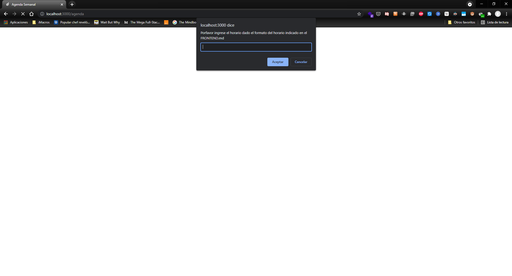
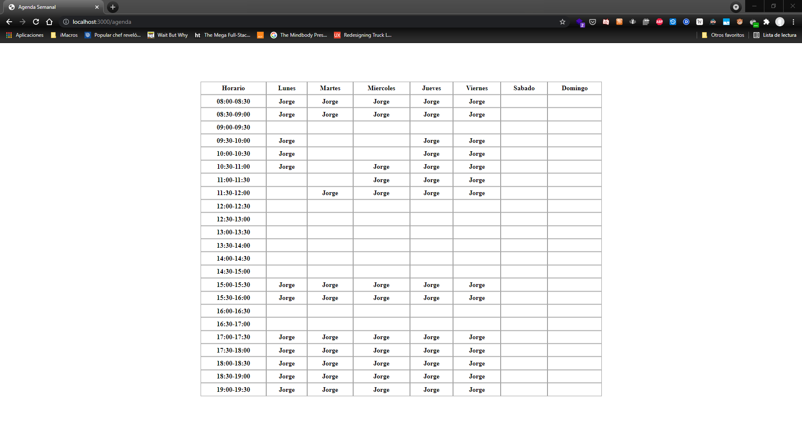

## STACK  

Se utilizo solo HTML, CSS y Javascript

## REQUERIMIENTOS

Hay que tener el servidor del backend abierto y acceder a la direccion localhost:3000/agenda

## SUPUESTOS

El formato de entrada para generar agenda es el siguiente (se utiliza **literalmente**
los nombres de los dias de la semana en ingles y los campos de name, start_time y end_time como esta en el codigo)
```
{
    "monday": [
        {"name": "Jorge", "start_time": "08:00", "end_time": "09:00"},
        {"name": "Jorge", "start_time": "09:30", "end_time": "11:00"},
        {"name": "Jorge", "start_time": "15:00", "end_time": "16:00"},
        {"name": "Jorge", "start_time": "17:00", "end_time": "19:30"}
    ],
    "tuesday": [
        {"name": "Jorge", "start_time": "08:00", "end_time": "09:00"},
        {"name": "Jorge", "start_time": "11:30", "end_time": "12:00"},
        {"name": "Jorge", "start_time": "15:00", "end_time": "16:00"},
        {"name": "Jorge", "start_time": "17:00", "end_time": "19:30"}
    ],
    "wednesday": [
        {"name": "Jorge", "start_time": "08:00", "end_time": "09:00"},
        {"name": "Jorge", "start_time": "10:30", "end_time": "12:00"},
        {"name": "Jorge", "start_time": "15:00", "end_time": "16:00"},
        {"name": "Jorge", "start_time": "17:00", "end_time": "19:30"}
    ],
    "thursday": [
        {"name": "Jorge", "start_time": "08:00", "end_time": "09:00"},
        {"name": "Jorge", "start_time": "09:30", "end_time": "12:00"},
        {"name": "Jorge", "start_time": "15:00", "end_time": "16:00"},
        {"name": "Jorge", "start_time": "17:00", "end_time": "19:30"}
    ],
    "friday": [
        {"name": "Jorge", "start_time": "08:00", "end_time": "09:00"},
        {"name": "Jorge", "start_time": "09:30", "end_time": "12:00"},
        {"name": "Jorge", "start_time": "15:00", "end_time": "16:00"},
        {"name": "Jorge", "start_time": "17:00", "end_time": "19:30"}
    ]
}
```
1. El horario de la agenda es de las 08:00 a las 19:30. **Los bloques de atencion son de 30min por lo que las unicas horas validas son terminadas en 0 minutos o 30 minutos **
2. Se permite tener un start_time y end_time que dure mas de 30 minutos como el ejemplo de {"name": "Jorge", "start_time": "17:00", "end_time": "19:30"} en donde se tiene agendado 2 horas y medias con la misma persona
3. Se debe entregar los dias de la semana **ordenados** como lo indica el ejemplo. Se soporta poner sabado (saturday) y domingo (sunday) 


## EJEMPLO

Al ingresar a localhost:3000/agenda se muestra la siguiente imagen:



Se debe copiar y pegar un horario en el mismo formato que el ejemplo anteriormente mostrado tomando en cuenta las supuestos. Al ingresar el ejemplo y Aceptar se puede ver el horario resultante en 



